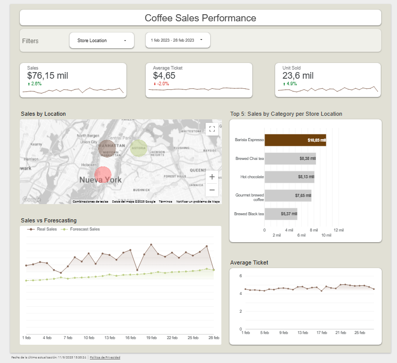
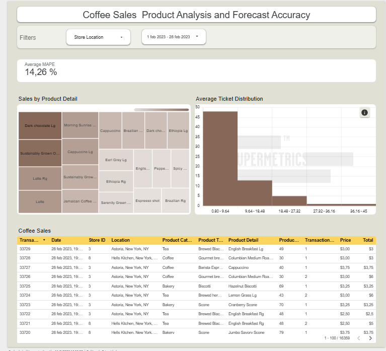

# ☕ Coffee Sales Performance Dashboard

# English
This project presents an **interactive dashboard** to analyze the sales of a coffee chain in New York.  
It includes historical sales metrics, store/category comparisons, average ticket, and sales forecasts using time series models.

---

## 📌 Key Features

### Page 1 – **Performance Overview**
- **Executive KPIs**:
  - Total sales vs previous month (with % variation).
  - Average ticket.
  - Total tickets (transactions).
- **Geographic & Product Breakdown**:
  - Sales by store (map view).
  - Top 5 categories by sales.
- **Trends**:
  - Real Sales vs Forecast (Prophet model).
  - Average ticket evolution.

### Page 2 – **Analytics & Forecast Accuracy**
- **Accuracy**: MAPE (Mean Absolute Percentage Error) global and by store.
- **Products**:
  - Sales by product detail (Treemap).
  - Average ticket distribution (histogram).
- **Transactional Detail**:
  - Table with date, store, product, price, and total.
  - Useful for exploration and export to Excel/CSV.

---

## 🛠️ Technologies Used
- **Python**: cleaning, aggregation, and time series modeling (**Prophet**).
- **PostgreSQL (Supabase)**: storage and creation of *views* to join real sales and predictions.
- **Looker Studio**: building the interactive dashboard.

---

## 🚀 Key Results
- Clear visualization of **current performance** and **future sales forecast**.
- Store comparison (Astoria, Hell’s Kitchen, Lower Manhattan).
- Accuracy metrics (MAPE) to evaluate model quality.
- Insights on customer behavior through average ticket and product detail.

---

## 📂 Repository Structure
```text
├── data/               # Input data (transactional sales, forecasts)
├── notebooks/          # Python modeling (Prophet, ARIMA, metrics)
├── sql/                # Queries and PostgreSQL views
├── dashboard/          # Dashboard screenshots and resources
└── README.md           # This file
```
---

## Dashboard
[View Dashboard in Looker Studio](https://lookerstudio.google.com/reporting/81573f48-4547-4c3a-9543-16c0e4954da9)
### Screenshots
### Page 1 – Performance Overview
[](https://lookerstudio.google.com/reporting/81573f48-4547-4c3a-9543-16c0e4954da9)

### Page 2 – Analytics & Forecast Accuracy
[](https://lookerstudio.google.com/reporting/81573f48-4547-4c3a-9543-16c0e4954da9)

</br>

</br>

</br>
</br>
</br>

✍️ Author: Eduardo Anica

📧 Contact: 
- [Email](mailto:eduardoan.data.expert@outlook.com)


- [Linkedin](https://www.linkedin.com/in/eduardo-anica-gonzalez/)

# Español
Este proyecto muestra un **dashboard interactivo** para analizar ventas de una cadena de cafeterías en Nueva York.  
Incluye métricas de ventas históricas, comparación por tienda/categoría, ticket promedio y proyecciones de ventas usando modelos de series temporales.


## 📌 Características principales

### Página 1 – **Performance Overview**
- **KPIs ejecutivos**:
  - Ventas totales vs mes anterior (con % de variación).
  - Ticket promedio.
  - Tickets (transacciones) totales.
- **Desglose geográfico y de productos**:
  - Ventas por tienda (mapa de ubicaciones).
  - Top 5 categorías por ventas.
- **Tendencias**:
  - Ventas reales vs Forecast (modelo Prophet).
  - Evolución del ticket promedio.

### Página 2 – **Analytics & Forecast Accuracy**
- **Accuracy**: MAPE (Error porcentual medio) global y por tienda.
- **Productos**:
  - Ventas por detalle de producto (Treemap).
  - Distribución del ticket promedio (histograma).
- **Detalle transaccional**:
  - Tabla con fecha, tienda, producto, precio y total.
  - Útil para exploración y exportación a Excel/CSV.

---

## 🛠️ Tecnologías utilizadas
- **Python**: limpieza, agregación y modelado de series temporales (**Prophet**).
- **PostgreSQL (Supabase)**: almacenamiento y creación de *views* para unir ventas reales y predicciones.
- **Looker Studio**: construcción del dashboard interactivo.


---

## 🚀 Resultados clave
- Visualización clara de la **performance actual** y el **forecast futuro** de ventas.
- Comparación entre tiendas (Astoria, Hell’s Kitchen, Lower Manhattan).
- Métricas de precisión (MAPE) para evaluar la calidad de los modelos.
- Insights sobre comportamiento de clientes a través de ticket promedio y detalle de productos.

---

## 📂 Estructura del repositorio
```text
├── data/               # Datos de entrada (ventas transaccionales, forecasts)
├── notebooks/          # Modelado en Python (Prophet, ARIMA, métricas)
├── sql/                # Queries y vistas en PostgreSQL
├── dashboard/          # Capturas y recursos del dashboard
└── README.md           # Este archivo
```

## Dashboard
[Ver Dashboard en Looker Studio](https://lookerstudio.google.com/reporting/81573f48-4547-4c3a-9543-16c0e4954da9)
### Capturas de Pantalla
### Pagina 1 – Vista de Resumen de rendimiento
[](https://lookerstudio.google.com/reporting/81573f48-4547-4c3a-9543-16c0e4954da9)

### Page 2 – Análisis y Precisión del modelo.
[](https://lookerstudio.google.com/reporting/81573f48-4547-4c3a-9543-16c0e4954da9)
</br>

</br>

</br>
</br>
</br>

✍️ Autor: Eduardo Anica

📧 Contacto: 


- [Email](mailto:eduardoan.data.expert@outlook.com)


- [Linkedin](https://www.linkedin.com/in/eduardo-anica-gonzalez/)